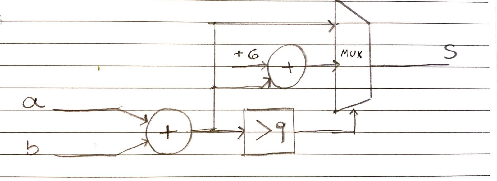

# DLP029007 : DISPOSITIVOS LÓGICOS PROGRAMÁVEIS II
- Professor :ROBERTO DE MATOS

- Departamento: COORDENADORIA DA ÁREA DE TELECOMUNICAÇÕES - SJE
- Formação: DOUTORADO
- E-Mail: roberto.matos@ifsc.edu.br

## AP1: Somador BCD

Muitos painéis de instrumentos usam o formato decimal codificado em binário (BCD), no qual 10 dígitos decimais são codificados usando 4 bits. Durante uma operação de adição BCD, se a soma de um dígito exceder 9, 10 serão subtraídos do dígito atual e um carry será gerado para o próximo dígito.

Dessa forma, projete um somador BCD de 4 dígitos que tenha duas entradas de 16 bits, representando dois números BCD de 4 dígitos, e uma saída, que seja um número BCD de 5 dígitos (20 bits).

### Somador binário

- [Resolução Somador binário](adder_bin) - Somador binário

### Somador BCD

- [Resolução Somador BCD](adder_bcd) - Somador BCD
#### Diagrama somador
</img>

## Conclusão

Um somador com decimais codificados em binário (BCD) é mais eficaz do que os somadores binários para aplicações envolvendo aritmética decimal, pois pode realizar as operações aritméticas diretamente em dígitos decimais, em vez de ter que converter os dígitos binários em decimais antes de realizar a aritmética. Em circuitos digitais, a representação usual de dígitos decimais é usando quatro dígitos binários (bits) por dígito, ou um BCD. Usar um somador binário para executar operações aritméticas em números BCD requer converter números BCD em números binários primeiro e, em seguida, adicioná-los usando a adição binária.
Esse processo de conversão é demorado e exige muitos recursos e pode diminuir a eficácia de um circuito. Em contraste, o adder-BCD é capaz de realizar as operações aritméticas diretamente nos números BCD e não requer o processo de conversão. Isso o torna mais eficiente para aplicativos que exigem aritmética baseada em decimal. Além disso, os BCDs do somador podem ser otimizados para velocidade e tamanho, tornando-os uma escolha perfeita para aplicações nas quais velocidade e tamanho são fatores-chave. Esse tipo de analise é de fácil identificação quando apenas se analisa os números dos componentes lógicos gerados por cada somador, enquanto o adder-BCD teve um total de 50 elementos lógicos e um tempo de atraso de 6.399 , já o adder-bin obteve 116 elementos lógicos.

## Dificuldades

Problemas de inclusão de testes com o componente [bin2bcd.vhd](adder_bin/bin2bcd.vhd) e não foi possível obter o tempo de atraso do mesmo.

#### Autor

<a href="https://github.com/jeffersonbcr">
     
    <b>Jefferson Botitano</b></a>

