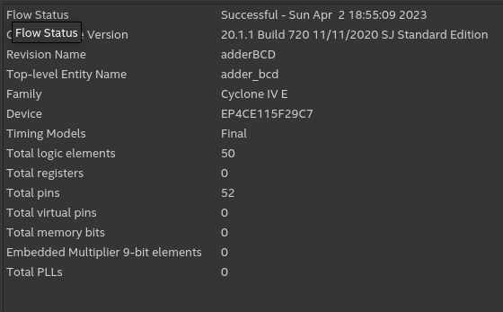

# Resolução

Este código VHDL descreve um somador decimal codificado em binário (BCD) que executa a adição de dois números de 16 bits e retorna o resultado como um vetor de 20 bits. Somadores BCD são uma tecnologia usada em aritmética decimal em circuitos digitais.
A entidade Adder_BCD tem duas entradas de dados, A e B, que são números de entrada que devem ser somados, e saída, S, que é o resultado da soma dos números A e B. Na arquitetura de adder_bcd_v1, os sinais a_signal e b_signal são definidos como std_logic_vectors para armazenar os valores dos sinais de entrada a e b.
A entrada, cin, é um vetor de 5 bits que representa a entrada transportada. Os componentes do somador são definidos na arquitetura para fazer adição em dois dígitos BCD de 4 bits, com a saída sendo o dígito BCD de 4 bits e um bit de execução, cout. A arquitetura contém o loop add_inputs resultante que usa o componente adicionador quatro vezes para realizar a adição de quatro dígitos BCD a e b.
O resultado é armazenado nas saídas s, que está em um vetor de 16 bits, e a saída é armazenada no próximo elemento do vetor cin. Finalmente, a adição de quatro dígitos BCD é convertida em um número BCD de 20 bits usando a string s(19 to 16)=(16 => cin(4), others =>0), que coloca o carry-out no bit mais alto do resultado s e preenche os bits restantes com zeros.

# Analysis Output
</img>

# Timer-analyzer Output

</img>