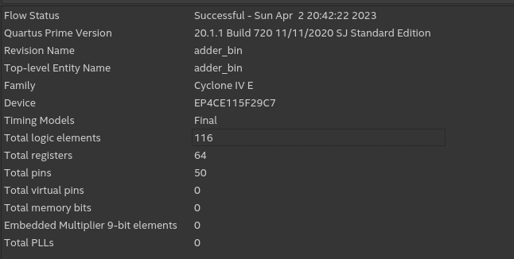
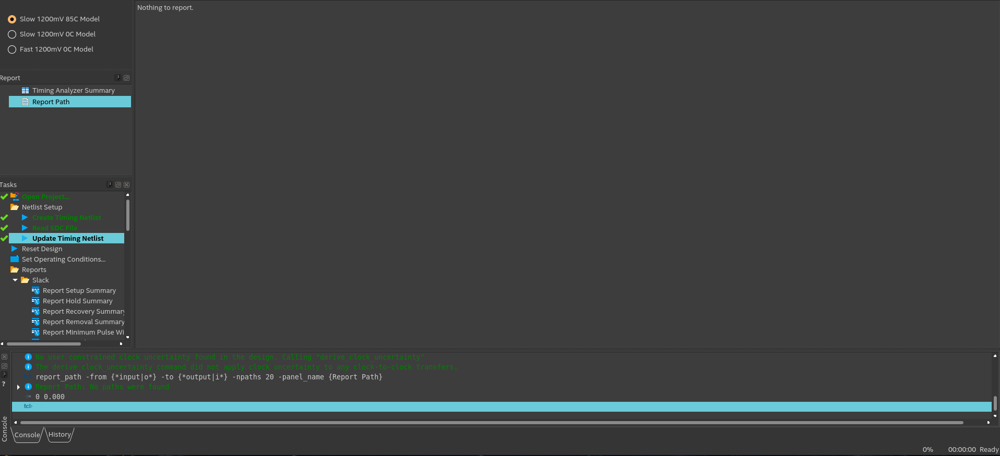

# Resolução

Este código VHDL descreve o somador binário e o conversor binário para BCD. A entidade Adder_bin tem entradas de a, b, clk e rst e saídas de s0, s1, s2, s3 e s4. As entradas a e b são números binários de 14 bits, enquanto clk e rst são sinais para o clock e o reset, respectivamente. As saídas s0, s1, s2, s3 e s4 são as somas binárias dos dígitos BCD.
A arquitetura Adder_bin_v1 instancia dois componentes: o adicionador e o bin2bcd. O componente adicionador executa a adição binária de dois números binários de 14 bits e retorna a soma binária de 16 bits para um sinal s_signal. O componente bin2bcd converte uma soma binária de 16 bits em um número BCD de cinco dígitos e emite números BCD para s0, s1, s2, s3 e s4. A arquitetura vincula o componente adicionador ao componente bin2bcd por meio do sinal s_signal e mapeia as entradas e saídas do componente para as entradas e saídas das entidades adder_bin, respectivamente.

# Analysis Output

</img>

# Timer-analyzer Output

</img>